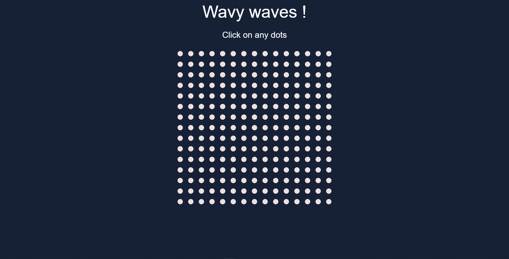

# Wavy waves

Wavy waves is a random javascript experience, no many use for this but it's still is interesting

## Technologies used:

- HTML
- CSS
- Javascript

## How to use it ?

Go to this [website]("http://atndesign.github.io/wavy-waves") (yup it's all you need to do)

## Screenshot

